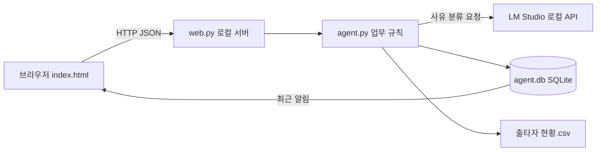

# 휴가 및 출장 처리 에이전트 구성

## 전체 흐름



이 프로젝트는 한 PC에서 시연하는 MVP입니다. `python web.py`로 시작하며 서버는 `127.0.0.1:8765`에만 열립니다. 외부 호스팅과 사용자 인증은 구성하지 않았습니다.

## 프론트엔드

`index.html`에 HTML, CSS, JavaScript가 모두 있습니다. 별도 빌드나 패키지 설치가 없습니다. `web.py`는 같은 화면 파일을 메인 `/`, 신청 `/apply`, 담당자 `/manager` 주소로 제공하고 해당 화면만 표시합니다. 메인에는 처리 현황과 두 페이지로 가는 링크가 있습니다.

신청 페이지는 대화 입력 대신 구조화된 필수 폼을 사용합니다. 신청자는 이름을 직접 입력하며 등록된 직원 이름은 제안으로 표시됩니다. 서버는 입력한 이름이 등록된 직원인지 확인하고, 소속 부서는 등록 정보에서 자동 표시합니다. 사용 날짜, 구분, 사용 시간, 사유를 입력하고 증빙이 있는 중요 출장은 자료 식별 정보도 입력해야 합니다. 여러 신청을 한 묶음으로 제출할 수 있습니다. 입력한 직원의 신청 상태와 알림을 확인하고, 자리 발생 응답과 복귀 후 경조사 증빙 제출도 이 페이지에서 합니다.

담당자 페이지는 전체 신청 현황, 승인·취소, 제출된 증빙 확인, 부서·직원 시연 데이터 설정, 전체 알림 기록을 보여줍니다. 두 페이지는 같은 `/api/state` 데이터를 읽고 상태 변경 후 다시 조회합니다. 이 화면 분리는 시연용 동선이며 사용자 인증이나 역할 권한 관리는 아직 없습니다.

브라우저는 `fetch`로 `/api/state`, `/api/models`, `/api/department`, `/api/employee`, `/api/submit`, `/api/change`를 호출합니다. 신청 결과와 상태 변경 후에는 `/api/state`를 다시 읽어 화면을 갱신합니다.

## 백엔드

`web.py`는 Python 표준 라이브러리의 `ThreadingHTTPServer`로 정적 화면과 JSON API를 제공합니다. 요청 크기를 제한하고 입력 오류를 JSON으로 반환합니다. `agent.py`가 실제 업무 규칙, 저장, CSV 갱신을 담당합니다. CLI 명령도 같은 `agent.py` 함수를 사용합니다.

`agent.py`는 신청의 필수 항목과 날짜를 서버에서도 검증합니다. 증빙이 있는 중요 출장에는 자료 식별 정보가 없으면 접수하지 않습니다. 휴가는 전일 1일, 오전·오후 반차 0.5일로 계산하고 직원의 잔여일을 검사합니다. 잔여일이 부족한 신청은 즉시 `rejected`로 기록하고 사유를 알립니다. 같은 묶음의 다른 신청은 계속 처리합니다. 출타율은 부서 총인원 대비 해당 시간대 승인·제안 인원으로 계산합니다. 전일은 오전과 오후에 모두 포함됩니다. 신청은 시작일(`day`)부터 종료일(`end_day`)까지의 기간 하나이며, 하루짜리는 두 값이 같습니다. 사용일은 기간 안의 평일만 세고(공휴일은 빼지 않음), 반차는 하루짜리 신청만 가능합니다. 기간이 겹치는 같은 직원의 신청은 중복으로 막습니다. 일반 신청은 즉시 승인하지 않고 `pending`(자동 승인 대기)으로 접수합니다. 접수 후 하루가 지나면 `settle()`이 같은 부서의 대기 신청을 모두 한꺼번에 계산합니다. 기존 승인 인원과 대기 신청 전체를 날짜·오전/오후별로 합쳐, 한 신청이 걸친 모든 날이 30% 이하이면 자동 승인하고 하루라도 넘으면 그 신청 전체를 책임자 확인으로 넘겨 사람이 고르게 합니다. 먼저 신청한 사람이 유리하지 않도록 하루 동안 모아서 판단하는 방식입니다. 사용일이 내일 이전인 신청은 하루를 기다리지 않고 다음 판정에서 바로 결정합니다. `web.py`는 1분마다 `settle()`을 실행하고, `python agent.py settle`로 직접 실행할 수도 있습니다. 경조사·증빙 출장 우선 검토, 모호한 사유의 책임자 확인, 잔여일 부족 반려는 접수 즉시 기존대로 적용합니다. 책임자는 30%를 넘더라도 수동 승인할 수 있습니다. 사유가 불명확하거나 모델 응답이 없으면 책임자 확인 상태로 저장하며, 이 건은 취소로 자리가 나도 자동 제안 대상에서 제외합니다.

승인이 취소되어 자리가 생기면 대기 신청 중 30% 이내에 들어오는 건을 `offered`로 바꾸고 진행 의사를 묻는 알림을 만듭니다. 수락(`yes`) 시 승인되고 거절(`no`) 시 책임자 확인 상태로 돌아갑니다.

## LM Studio 연결

`agent.py`는 기본적으로 `http://127.0.0.1:1234/v1`의 `/models`와 `/chat/completions`를 호출합니다. 설치된 모델 중 `qwen/qwen3-8b`가 있으면 우선 사용하고, 없으면 목록의 첫 모델을 사용합니다. `LM_STUDIO_MODEL`로 모델 ID를 지정할 수도 있습니다. JSON 스키마 출력으로 사유를 `family_event`, `important_trip`, `other`, `uncertain`으로 분류합니다. 분류 기준은 특정 단어 목록이 아니라 친족 관계의 명시 여부, 구체적 업무 목적의 명시 여부, 정보 부족 여부입니다. 모델은 승인 상태를 직접 변경할 수 없습니다. 잘못된 모델 응답이나 연결 오류는 `uncertain`으로 처리합니다.

## 데이터와 알림

`agent.db`는 부서, 직원, 신청, 알림을 저장하는 SQLite 파일입니다. 신청 상태는 `pending`, `approved`, `manager_review`, `priority_review`, `offered`, `rejected`, `canceled`를 사용합니다. 승인 상태가 바뀌면 `출타자 현황.csv`를 다시 만들어 Excel에서 바로 열 수 있게 합니다. CSV는 UTF-8 BOM 형식입니다.

친인척 경조사에는 별도 `proof_status`가 붙습니다. 책임자 승인 후에도 `pending`으로 남고, 복귀 후 PDF·PNG·JPG 증빙서를 제출하면 `submitted`, 책임자가 파일을 확인하면 `verified`가 됩니다. 파일은 최대 5MB이며 로컬 `proofs/` 폴더에 저장됩니다. 화면과 개인 알림에 복귀 후 제출 의무를 표시합니다. 파일 내용의 진위는 책임자가 확인해야 합니다.

알림은 `notices` 테이블에 직원별 메시지로 기록됩니다. 사내 메신저 제품이 지정되지 않은 시연 버전이므로 실제 메시지 전송은 연결하지 않았습니다. 시간차, 다일 신청, 권한 관리도 현재 화면 범위에 포함되지 않습니다.

## 메일 신청

`mail_agent.py`는 메일 한 통마다 LLM이 도구를 골라 행동하는 에이전트입니다. 도구는 `ask`(빠지거나 모호한 정보 되묻기), `leave_balance`(잔여일 조회), `capacity`(해당 날짜·시간대 30% 여유 확인), `propose`(이해한 신청 내용을 직원에게 제안), `reply`(신청이 아닌 메일에 답하고 종료)입니다. 최대 6단계 안에서 LLM이 조회하고, 되묻고, 제안할지 스스로 정합니다. 진행 중인 대화와 확인 대기 중인 제안은 `mail_drafts`에 직원별로 저장되고 답장이 오면 이어집니다.

**LLM은 접수할 수 없습니다.** `propose`는 날짜(요일 포함)·구분·시간·사유·증빙을 코드가 쓴 문장으로 직원에게 보여주기만 합니다. 직원이 답장 첫 줄에 "확인"(또는 네·예·ok)이라고 쓰면 LLM을 거치지 않고 코드가 저장된 제안을 기존 `submit()`으로 접수합니다. 그 밖의 답장은 수정 요청으로 LLM에 넘어가고, LLM은 고친 내용을 다시 제안합니다. 자유 문장 해석은 LLM이든 규칙이든 틀릴 수 있으므로, 되돌리기 어려운 접수 직전에 정답을 아는 본인이 확인하게 한 구조입니다. 해석 오류는 메일 한 통을 더 쓰는 불편으로 끝나고 잘못된 접수가 되지 않습니다. 대신 메일 신청마다 확인 답장이 한 번 더 필요합니다.

날짜는 LLM이 다루지 않습니다. 코드(`email_dates()`)가 직원이 보낸 메일 중 날짜를 언급한 가장 최근 메일 원문에서 날짜 표현("낼", "담주 금욜", "12.22", "12월 31일(목)", "Dec 17")을 모두 찾고, `resolve_date()`로 계산합니다. "A부터 B까지", "A~B"는 기간으로 읽고, 종료일에 월이나 주가 빠지면("21일부터 23일까지", "월요일부터 수요일까지") 시작일 기준으로 채웁니다. 하루 또는 기간이 정확히 하나일 때만 제안에 씁니다. "연차 3일"처럼 월 없는 숫자는 찾은 기간의 일수와 같을 때만 일수로 인정합니다. "지난주 금요일", "16일로"처럼 하루로 정할 수 없는 표현이 있거나, 서로 다른 날짜가 둘 이상이거나, "12월 15일(수)"처럼 적힌 요일이 날짜와 맞지 않으면 LLM에게 되묻게 합니다. 수정 요청 메일에 새 날짜가 있으면 그 날짜가 이전 날짜를 대신합니다.

신청자는 메일 본문이 아니라 등록된 발신 주소(`employee_emails` 테이블)로 정합니다. 접수는 기존 `submit()`을 거쳐 30%·잔여일 규칙을 그대로 적용하고, 승인·취소 도구는 없습니다. 제안과 접수 결과 문장은 LLM이 아니라 코드가 작성합니다. 메일로 접수한 신청도 같은 `requests` 테이블에 들어가므로 웹 담당자 화면에 그대로 표시됩니다.

실제 모델 동작은 `python evaluate_mail.py eval_mail/<set>.json`으로 확인합니다. 평가 절차와 결과는 `EVALUATION.md`에 있습니다.

메일함은 IMAP으로 폴링하고 SMTP로 답장합니다(`MAIL_USER`, `MAIL_PASSWORD`, `IMAP_HOST`, `SMTP_HOST`). 등록되지 않은 주소, 자동 발송 메일, `dmarc=pass`가 없는 메일에는 답하지 않습니다. DMARC가 없는 사내 메일 서버에서는 `MAIL_TRUST_SENDER=1`로 끄고 내부 전용 메일함을 사용해야 합니다.

```powershell
python mail_agent.py register 김하나 hana@example.com
python mail_agent.py try hana@example.com "다음 주 화요일 오후 반차 쓸게요, 병원 진료입니다"
python mail_agent.py run
```

## 실행과 확인

```powershell
python web.py
python test_agent.py
```

테스트는 30% 경계값, 동시 신청, 반차, 잔여일, 예외, 모호한 사유, 취소·대기자 수락, 복귀 후 증빙, 웹 API를 확인합니다. 실제 모델 분류 샘플은 `python evaluate_model.py`로 따로 확인합니다.
